# マイコン実習 第４クォーター

第４クォーターは主に PLC とマイコン (RaspberryPi) の共存について学びます。  
また途中、技能照査 (こちらは Arduino) についての試験対策を２回 (８時間) 予定しています。
PLC とマイコンの似ているとことろ、違うところを理解して両方のいいとこどりができるのを目指します。

# 利用ハードおよびサービス

- Raspberry Pi Model3 B+
良否判定システムで使った RaspberryPi を使用する。

- OpenPLC  

OpenPLC は PLC の挙動をマイコンやパソコン (Raspberry Pi や Arduino, Windows, Mac etc.) で実現するためのソフトウェアである。

https://autonomylogic.com/  
  > OpenPLC is an open-source Programmable Logic Controller that is based on an easy to use software.  
  > OpenPLC は扱いやすいソフトウェアをベースにしたオープンソースな PLC です。  
  
OpenPLC はプログラム (ラダーチャートなど) を開発するための OpenPLC Editor とそれを実行するための OpenPLC Runtime のふたつで構成される。この授業では、Windows PC 上に OpenPLC Editor をインストールし、Raspberry Pi 上にプログラムの実行環境である OpenPLC Runtime をインストールする。

<center>

</center>

## OpenPLC Editor

OpenPLC Editor のセットアップ。下記のアドレスからソフトウェアをダウンロードしインストールする。Arudino の IDE のように寄付を受け付けているので、有志の方はどうぞ。

- https://autonomylogic.com/download

OpenPLC Editor を起動すると以下のような画面になる：

<center>

</center>

### プロジェクトの作成

ファイル → New で新しいプロジェクト用に空のフォルダを開くように求められる。OpenPLC 用のフォルダに移動し、右クリックして空のフォルダを作成する。ここでは ドキュメント → OpenPLC → Pj1 とする。

Create a new POU のメニューの "Language" を LD (ラダー) にする。ラダー言語でプログラミング可能なエディタが開く。

### PLC の標準言語「ラダープログラム」とは

ラダープログラミングは以下の特徴をもつ：
- 覚えなければならない文法はない  
I/O の位置と名前、約束事、記号の意味がわかれば、とりあえずはプログラムが書ける
- ジャンプも分岐もない。プログラム全体が大きなループでできている。
- 国際基準仕様：IEC 61131-3

### 基本はリレー

1 ビットの記憶回路は以下のようになる：

<center>
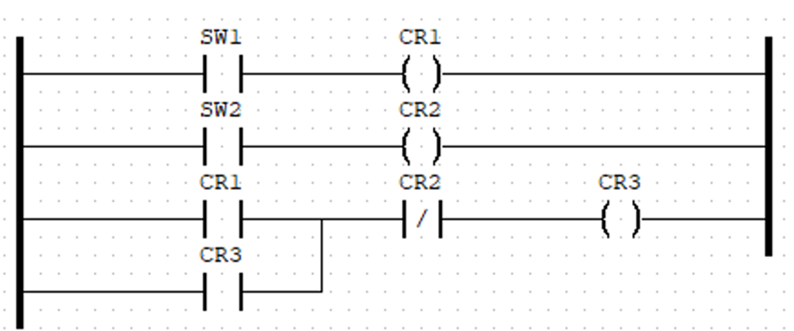
</center>

こちらのプログラム例は <a href="./Sample.zip"/>Sample.zip</a> からダウンロードできる。

## OpenPLC での Raspberry Pi の入出力端子

OpenPLC で使える入力端子にはつぎのように名前がついている：

- **%IX#.#** は入力
- **%QX#.#** は出力  

Raspberry Pi で OpenPLC (の Runtime) を実行する場合、Rasbperry Pi のハードウェア上、ピンにはつぎの制限がある：

- 端子への入力は 3.3V でないといけない  
(PLC のように) 24V ではないので注意する
- ％IX0.0 (2番 PIN), %IX0.1 (3番 PIN) は Raspberry Pi の基板ですでに 1.8KΩ でプルアップされている。動作としては b 接点になる（下の図を参照）。
- その他の PIN は CPU 内部でプルダウンされていて、動作としては a 接点になる

<center>
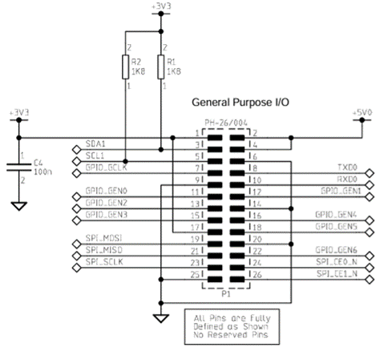
</center>

|入力リレー |  |出力リレー    | |
|---------|---------|---------|---------|
|ピン番号|機能|ピン番号|機能|
|1| 3.3V Power |2| 5V Power|
|3| %IX0.0     |4| 5V Power|
|5| %IX0.1     |6| GND     |
|7| %IX0.2     |8|  %QX0.0 |
|9| GND        |10| %QX0.1 |
|11| %IX0.3    |12| %QW0(PWM)|
|13| %IX0.4    |14| GND|
|15| %IX0.5    |16| %QX0.2 |
|17| 3.3V Power|18| %QX0.3 |
|19| %IX0.6    |20| GND|
|21| %IX0.7 Power |22| %QX0.4 |
|23| %IX1.0    |24| %QX0.5 |
|25| GND       |26| %QX0.6 |
|27| NC        |28| N/A |
|29| %IX1.1    |30| GND |
|31| %IX1.2    |32| %QX0.7 |
|33| %IX1.3    |34| GND |
|35| %IX1.4    |36| %QX1.0 |
|37| %IX1.5    |38| %QX1.1 |
|39| GND       |40| %QX1.2 |

# OpenPLC Runtime

## ホスト名の設定

ネットワーク経由でアクセスするために RaspberryPi にホスト名をつける

raspi-config を起動しホスト名をつける (ex. kubota-pi)：
```
sudo raspi-config
```

再起動。

RaspberryPi に OpenPLC Runtime をセットアップする。

```
git clone https://github.com/thiagoralves/OpenPLC_v3.git
cd OpenPLC_v3
./install.sh rpi
```

``rpi`` が RaspberryPi であることを示す。その他に Windows や PC 上の Linux などにセットアップすることができる。

インストールできたら再起動する。

### WiringPi
OpenPLC を動かすためには WiringPi が必要。ただし注意として WiringPi はすでに開発を停止しており今後バージョンアップはない。今後、OpenPLC プロジェクトが WiringPi の後継に対応すると思われる。(ここで使っているのはアーカイブ)
- https://github.com/WiringPi/WiringPi/releases/  
にアクセスし、ページ下部にある wiringpi-2.61-1-arm64.deb をダウンロードし、dpkg コマンドを使ってインストールする：  

```
dpkg -i wiringpi-2.61-1-arm64.deb
```

gpio コマンドが動作すれば OK:
```
gpio -v 
gpio version: 2.61
Copyright (c) 2012-2018 Gordon Henderson
This is free software with ABSOLUTELY NO WARRANTY.
For details type: gpio -warranty

Raspberry Pi Details:
  Type: Pi 3B+, Revision: 03, Memory: 1024MB, Maker: Sony
  * Device tree is enabled.
  *--> Raspberry Pi 3 Model B Plus Rev 1.3
  * This Raspberry Pi supports user-level GPIO access.
```

# OpenPLC Editor 起動

起動画面が立ちあったら、File => New を選択し、空のフォルダを作成しプロジェクトフォルダにする。

<center>
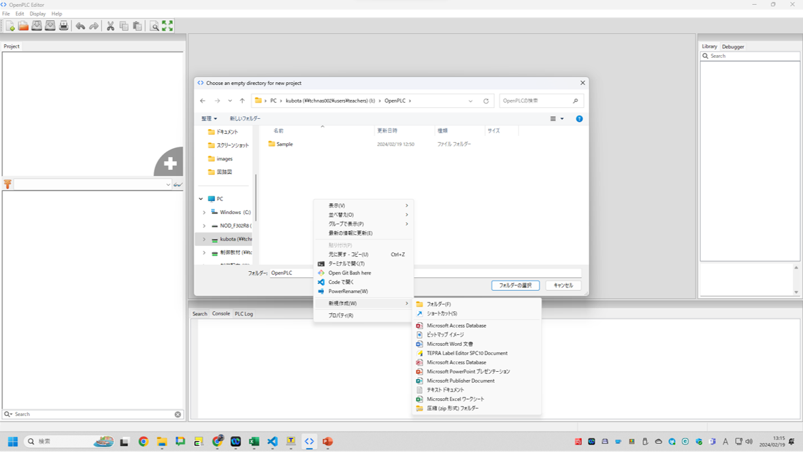
</center>

## ラダーのプログラミング

画面上部に使用する変数を宣言し、画面下部にラダー図を記入する。

<center>
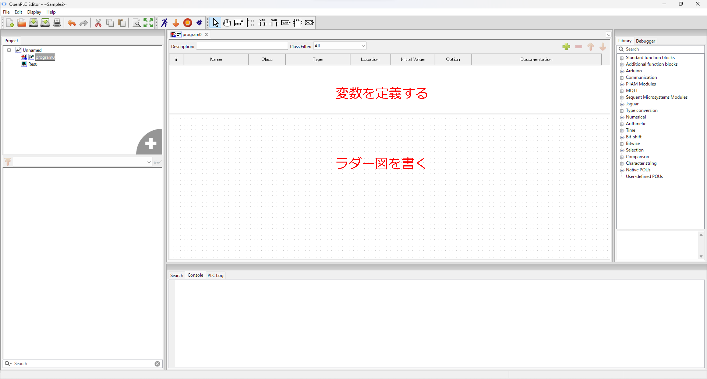
</center>

## プログラムのシミュレーション実行

画面上の人型アイコンでプログラムをシミュレーション実行できる。
画面左のメガネアイコンをクリックするとラダープログラムのモニタが表示される。

モニタでは、配線や接点（スイッチ）が通電している状態は緑色で示される。
モニタを終了するにはタブを閉じるだけでよい。

<center>
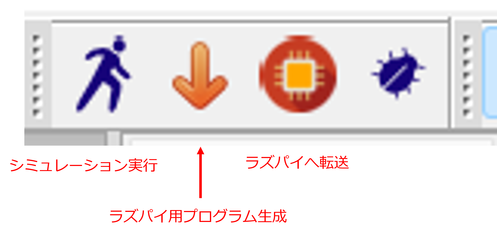
</center>
<center>
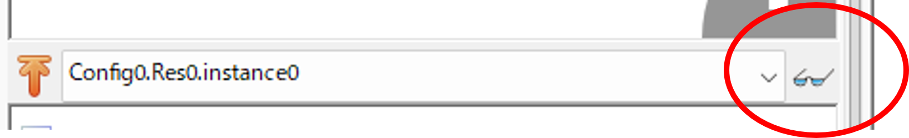
</center>

### 強制 ON/OFF 機能

「スイッチを押したり離したり」を再現するには、強制 ON/OFF 機能を使う。
接点やコイルを右クリックすると Force True (強制ON), Force False (強制 OFF), Release Value (強制操作の終了) のメニューが表示される。

#### SW1 を強制 ON

SW1 を強制 ON にすると CR3 も ON になる。
SW1 を強制 OFF にすると SW1 は濃い青色に変化する。

<center>
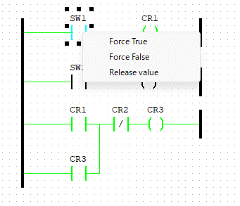
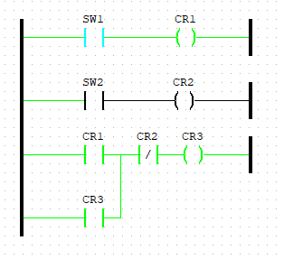
</center>

#### SW2 を強制 ON

SW2 を強制 ON すると CR2 が ON となって、下段 CR2 の B 接点が OFF になり、CR3 の保持プログラムが切れる。

<center>
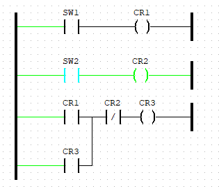
</center>

### ラダーの順番やその他

- ラダーの上下はプログラムの動作には関係ない
- パワートレイン (電源ライン) はそれぞれが切れていてもよい。

## 変数のモニタ機能

OpenPLC エディタにはもう一つのデバッグ機能 (変数のモニタ) がある。
左下窓のリストからモニタ (確認) したい変数のメガネアイコンをクリックする。

<center>
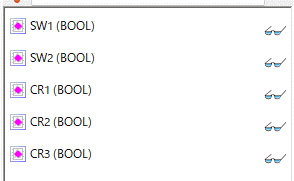
</center>

<center>
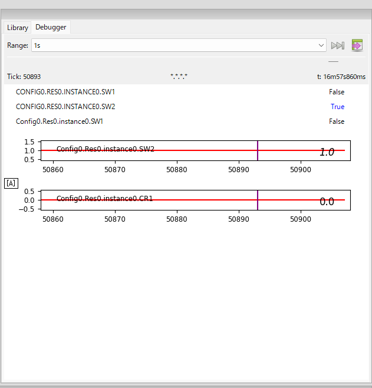
</center>
