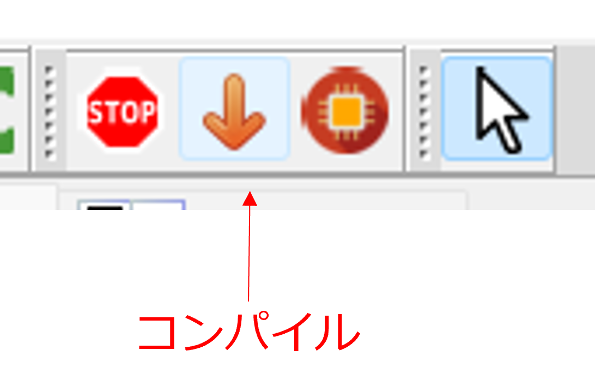
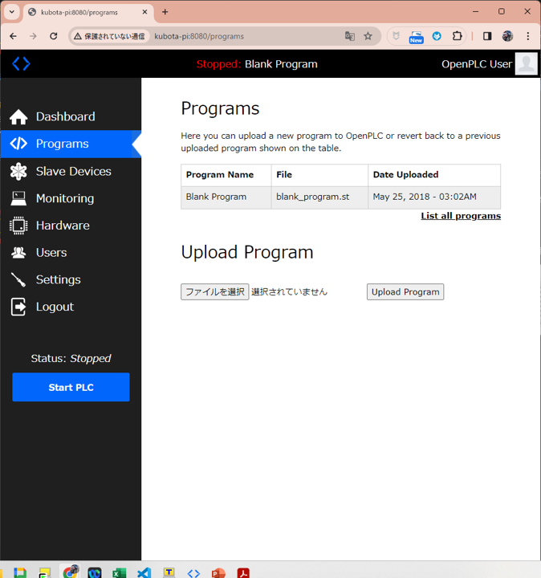
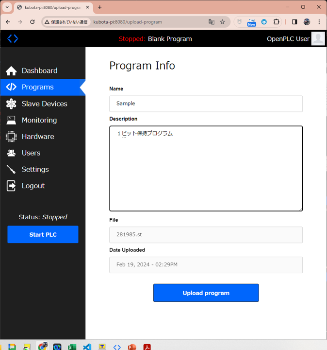
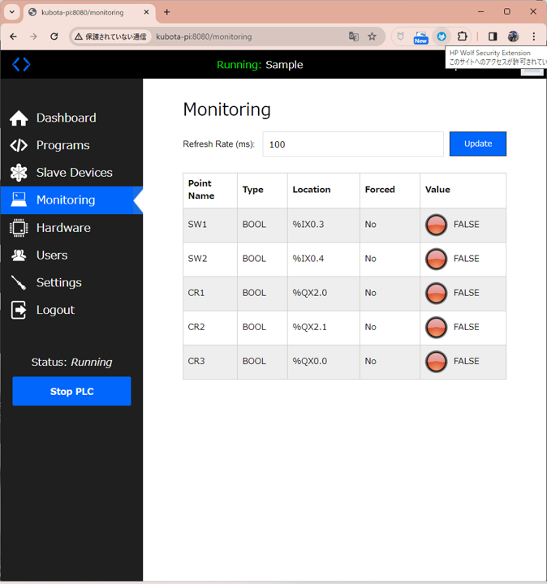
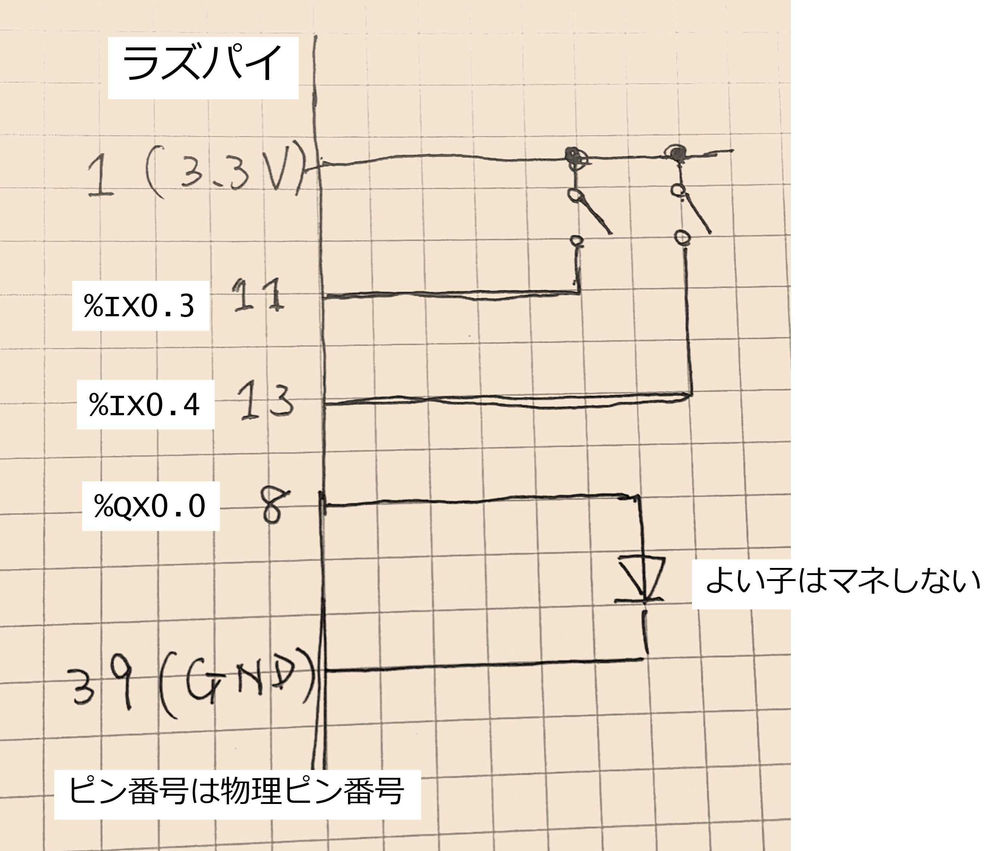
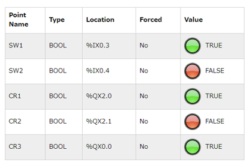
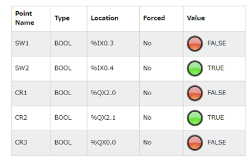

# OpenPLC 起動

Windows (RaspberryPi でブラウザを立ち上げてもいいが遅い！) でブラウザを立ち上げ、http://<名前>-pi:8080/ にアクセスする。

username: openplc  
password: openplc 

でログインする。

**http と https の違いは前回話した通り。注意しましょう。**

## 最初に必要な設定

まず最初にダッシュボードの左のメニューから Hardware をクリックし、RaspberryPi を選択して、下の方の "Save changes" をクリックする。
そうすると必要な準備が完了する。

この設定は１回だけ行えばよい。

## ラダープログラムの実行

OpenPLC Editor で作ったラダープログラム（ラダーでなくてもいいけど）を Raspberry Pi に転送して OpenPLC Runtime 上で動作させる。
ここでは、前回作成した 1 bit の状態保持回路を転送してみる。

### 手順

#### ラダープログラムをコンパイルして転送用のファイルを作る

↓ボタンをクリックするとラズパイ用の実行ファイルが生成（コンパイル）される。拡張子は 〇〇〇.st になる。

ダッシュボードの Programs メニューからファイルを選択し、いま生成した〇〇〇.st をラズベリーパイにアップロードする。

Name (名前)、Description (説明) を加えて Upload Program ボタンをクリック。

### プログラムを起動する

左側の Start PLC ボタンをクリックする。

## 動作プログラムのモニタリング

Dashboard の Monitoring メニューを選ぶと、現在動作しているプログラムの変数が現れる。

# 確認用回路を作ってみよう

せっかくなので確認用の回路を作ってみよう。ブレッドボード上にタクト SW x 2、LED を用意して接続してラズパイと接続してみよう。

## SW1/SW2 ボタンを押してみる

SW1 を押すと LED が点灯する。離しても点灯したまま（記憶される）。
SW2 を押すと LED が消灯する。（リセット）

またウェブブラウザ画面でも SW1, SW2, CR1, CR2, CR3 の状態がリアルタイムに更新される。(ただし 100ms 更新なのでタイムラグを感じる)

- SW1 を押したとき。SW1, CR1, CR3 が ON

- SW2 を押したとき。SW2, CR2 が ON, CR3 は FF

# プログラムの終了

画面左のボタン「Stop PLC」をクリックすると PLC のプログラムが終了する。

