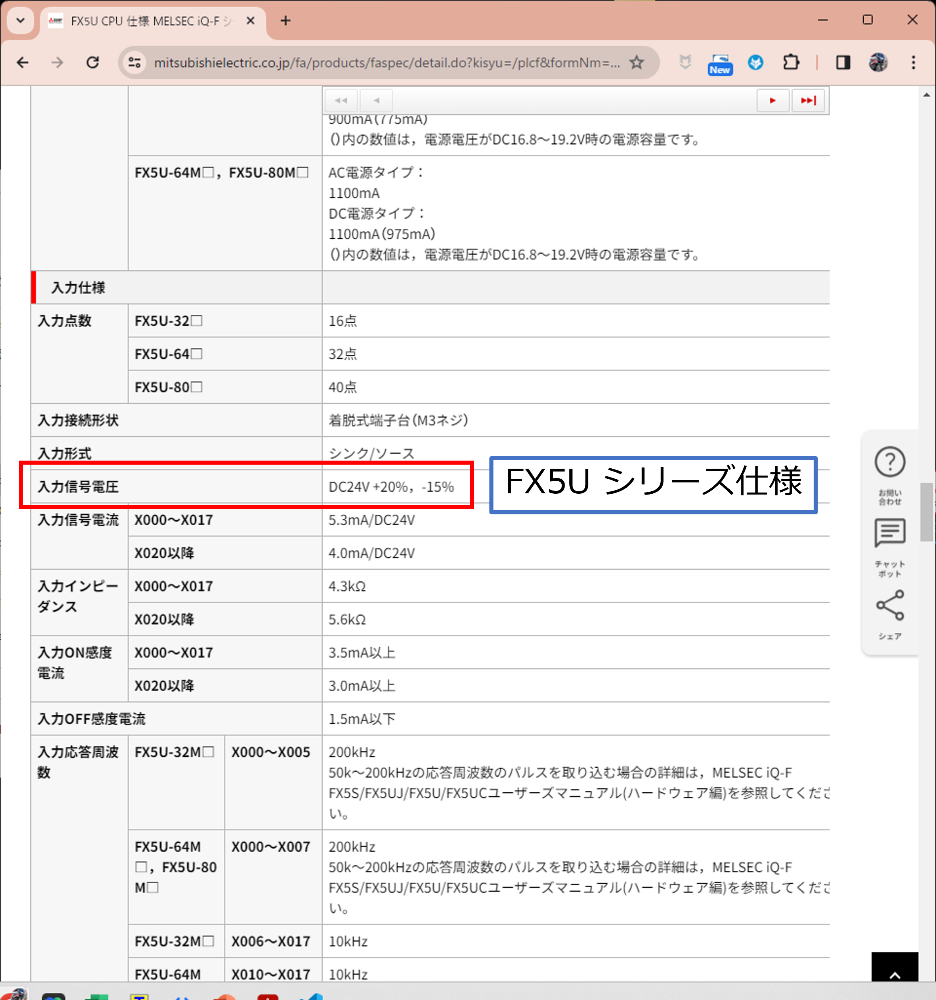
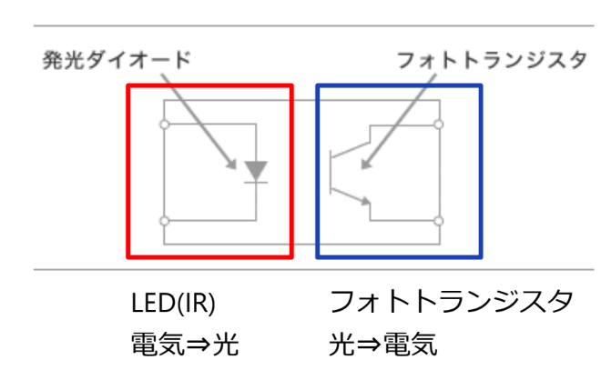
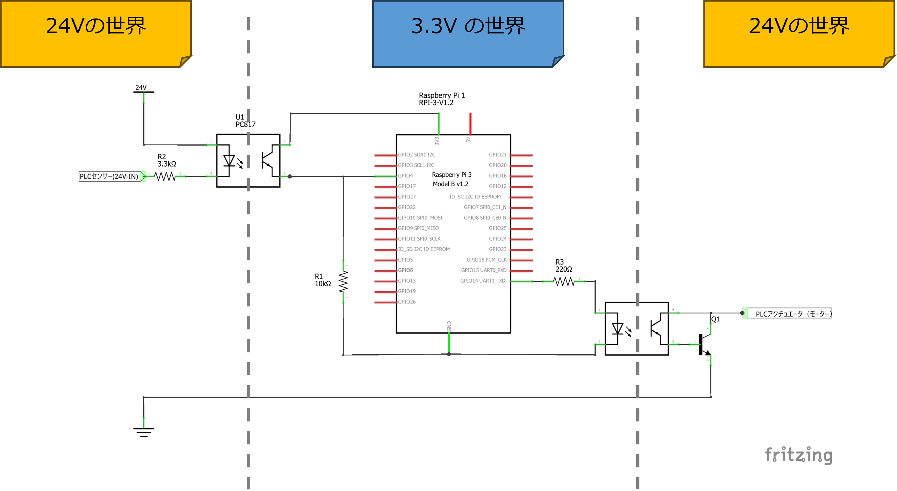
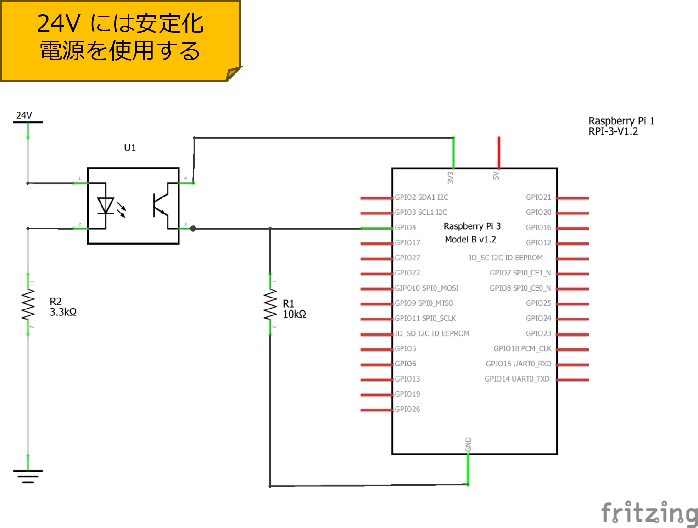
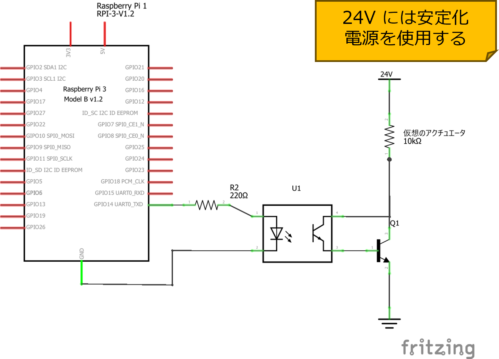

# ラズパイ PLC で Pick & Place を動かす

*ラズベリーパイからリレーを駆動し AC 100V を ON/OFF するために　DC２４アイソレート I/O 基板を作る。*

ラズパイの GPIO 端子は 3.3V 数 mA しか出力できない。このままでは、 AC100V を ON/OFF するためのリレーの駆動はできない。そこでラズパイに外付けの DC24V アイソレート I/O 基板を作成する。

まず I/O 基板の回路の動きを開設しその後ユニバーサル基板上での部品の配置方法や制作のコツについて触れる。

## Pick & Place に必要な I/O

マイコン(PLC) 側から見た入力：

マイコン (PLC) 側から見た出力：

## なぜ DC24V?

### メーカー製 PLC の I/O には DC24V が使われている

多くの PLC では DC24 V がI/O に使われている。DC24V という電圧は電子回路やマイコンではあまり使われることはない。

マイコンは 3.3V や 5V の世界。PLC は 24V の世界。

PLC 業界が 24V の理由はいろいろあるようです。興味のあるひとはネットで調べてみたりChat-GPT に聞いてみたりしてください。

マイコンが 3.3V や 5V なのはトランジスタの動作にこれくらいが具合がいいからです。消費電力を抑えるため、もっと小さな電圧 1.8V が主流になりつつあります
（スマートフォンなどの LSI は動作電圧 1.8V です）。

どのようにマイコンと PLC の間で信号をやりとりするか？これが PLC マイコン化計画の問題になる。

## ステップ１フォトカプラ

このような問題を取り扱うにはセンサー工学で学んだ「フォトカプラ」を用いる。
フォトカプラ…覚えていますか？

フォトカプラは、フォトダイオードで電気信号を光に変えて発光し、フォトトランジスタでそれを受光することで光を電気信号に戻す。
フォトダイオードとフォトトランジスタの間では電気的な絶縁状態となる。

フォトカプラを使うことにより 5V の信号を光に変え、24V の信号を光に変え、相手に渡してあげることで、動作電圧の違いを吸収する。

<a href="https://drive.google.com/file/d/1PmLE28Ua4LTSeXLcicvdSTNaa-WGs759/view?usp=drive_link">センサ工学5.pdf</a>

## ステップ２トランジスタ

フォトトランジスタで電気信号に戻った電気は大変弱いため、トランジスタで増幅する。

## 組み合わせる

ステップ１とステップ２を組み合わせると以下のような回路が形成される。
フォトカプラを境界にして左右は 24V の PLC の世界である。真ん中部分は Raspberry Pi の 3.3V の世界である。

これを P&P の入出力に必要な数だけ用意すればいい。

## 入力（センサー）
1. 右リードスイッチ
2. 左リードスイッチ
3. 上昇限
4. 下降限

## 出力（アクチュエーター）
1. コンベア右
2. コンベア左
3. ハンド上昇
4. ハンド下降
5. ハンド（チャック）開放

これまで学習した「フォトカプラ」、「トランジスタ」、「プルダウン抵抗」、「LED 電流制限抵抗」などの技術が利用されていることに留意すること。

# 演習

ブレッドボード上に、入力回路部分を作成し、動作を確認せよ。

### チェック項目

1. 24V 電源には安定化電源を使用する。
3. フォトカプラからの出力を Raspberry Pi の 11 番ピン (%IX0.3) に入力する。
1. Raspberry Pi では前回作成した OpenPLC の１ビット記憶回路を動作させる。
2. 24V 電源を ON すると１ビットSET が動作すること (QX0.0 の LED が点灯すること) を確認せよ。
3. 24V のセンサー入力を受けつけるフォトカプラのダイオード 3.3KΩの理由をフォトカプラのデータシートから考察せよ。  
 <a href="https://classroom.google.com/c/NTE4MDkwMjkyNzU2/m/NjQ4OTYxNzE1NDcz/details">フォトカプラ PC817 データシート</a>
5. 安定化電源の第２系統を使い、13 番ピン (%IX0.4) についても同じ回路を作成せよ。
7. 安定化電源を第２系統を ON にすると RESET が動作することを確認せよ。

## **注意**
接続を誤って 24V を Raspberry Pi に直接印加（入力）すると、必ず！ Raspberry Pi が壊れます。  
不安なひとは作成した回路を先生に確認してもらってください。

# 演習

ブレッドボード上に、出力回路部分を作成し、動作を確認せよ。

### チェック項目

1. OpenPLC 上で %IX0.3 を強制 ON (すなわち SET) にし、%QX0.0 に１ビット (H) が出力されるようにせよ。
2. この状態で右側の 10KΩ の両端にかかる電圧値をテスターで調べよ。
3. %IX0.3 を強制 OFF にしたあと、%IX0.4 を強制 ON (すなわち RESET) したら、出力電圧がどうなるか確認せよ。
4. 右の抵抗は仮のアクチュエーターであり、実際の PLC 等ではここにモーターを接続する。24V 対応のランプでもよい。
5. このような接続方法は、機器を接続する前はトランジスタのコレクタ側が未使用 (オープン) な回路となるため「オープンコレクタ」と呼ぶ。

## **注意**
接続を誤って 24V を Raspberry Pi に直接印加（入力）すると、必ず！ Raspberry Pi が壊れます。  
不安なひとは作成した回路を先生に確認してもらってください。

