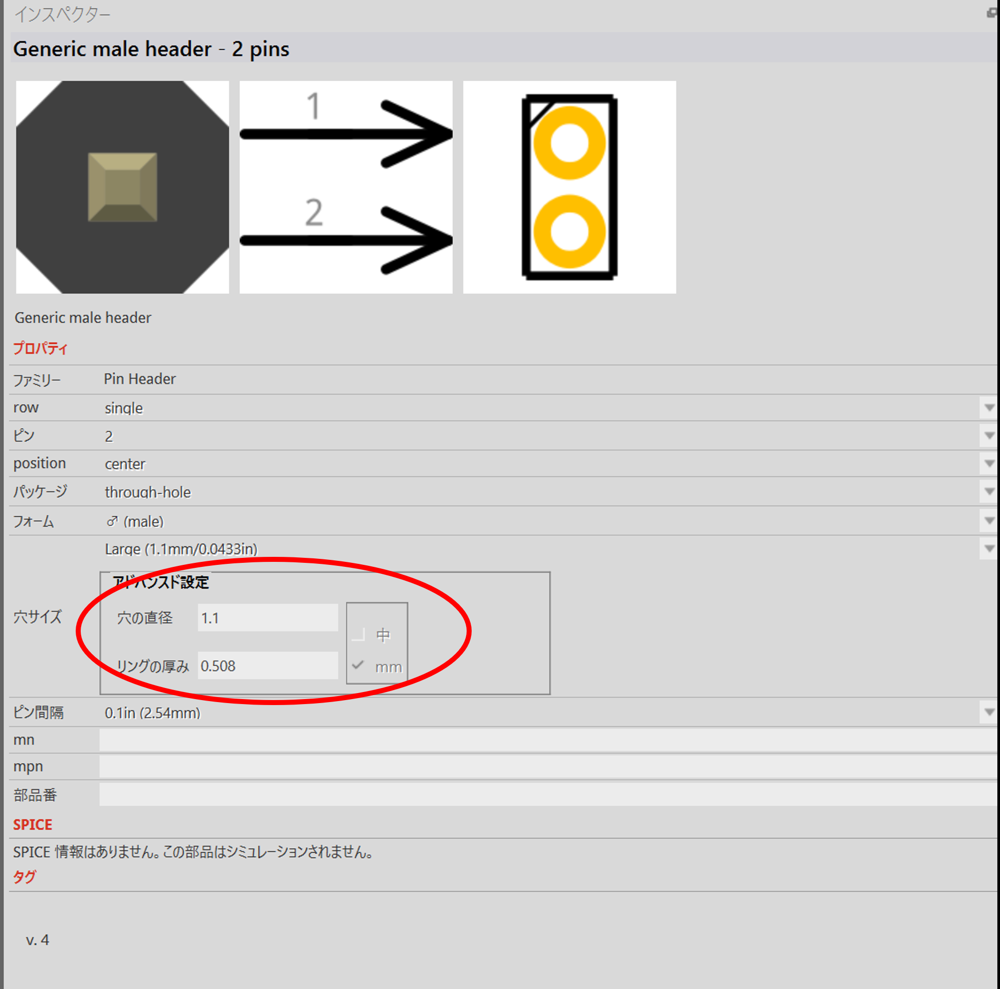

# Fritzing

## の前にプログラミングについて少し

前回までで、マイコン (Raspberry Pi) から P&P を制御するために必要な基礎的なことがらを学習した。

1. OpenPLC (ソフトウェア版 PLC) によるプログラミング
   OpenPLC エディタ
   OpenPLC ランタイム
2. フォトカプラとトランジスタによる回路 (マイコンと PLC の動作電圧の違いを吸収する方法)

以上が理解できれば、あとはその組み合わせである。
項目１は、OpenPLC を使う方法もあるし、Python を使う方法もある。
ただし、PLC (ラダー) プログラミングと Python プログラミングでは、考え方のアプローチが異なるので、すこし頭の切り替えをしないとなれないうちは、戸惑うかもれない。

例えば、ラダーは「行の順番」を特に意識しない。一方、Python のようなプログラミング言語は「行の順番」がとても大事である。
また、ラダーはマイコン制御の授業ですこし触れたが、「イベント駆動」方式が前提になっている。「スイッチが押される」「センサーが反応する」など何かしら「イベント」が契機となってプログラムが実行される。
一方、Python は、特別な命令を使わなければ、通常「イベント駆動」なプログラムにはならない。上から下に書いた順番で実行される。

どちらがいい、悪いではなく、そういうプログラミングスタイルである、ということを少し念頭に入れておくとよい。

# Fritzing

Fritzing とは https://fritzing.org/ によると：

>> Fritzing is an electronics design and prototyping platform for makers, hobbyists, and educators. Easily create and document your electronic projects.

>> Fritzing とは、メーカー、アマチュア、教育関係者のための電子回路設計およびプロトタイピング (試作) 用プラットホームです。電子工作プロジェクトが簡単に作成、ドキュメント化できます。

とある。

ここでは、簡単な回路作成を通して Fritzing の習得を目指す。

そして、この科目の最後には P&P 用の基盤を Fritzing を用いて作成し、マイコンによる P&P 操作を実現したい。

## Fritzing でできること

Fritzing では次のようなことができる

## ブレッドボード配線図の作成

## 回路図の作成

## 基板設計

それぞれの図はお互いにリンク（連携）していて、一方に加えた変更が他の図面も連動して変化する。

## 基盤やセンサー主要部品が登録されている

ただし英語で検索しないといけない。
抵抗は "resistor"、コンデンサは "capacitor"、トランジスタは "transistor" など。

また、インターネット上では Fritzing で利用可能なパーツのライブラリ（部品集）が公開されている。ダウンロードすると利用できる。

それでもない部品は自作することができる。ただし少々テクニックがいる。（興味がわいた、仕事で使うことになった、そしたら調べてみて！）

# 作成する回路

次の回路を作成する。これはフルカラー LED の調光回路である。
可変抵抗を調節することで、R,G,B の各色の明るさを調節して任意の色を発色するようにする。
回路には２ピンのピンヘッダを用意し、そこから電源 (5V) を供給する。

## 手順

ブレッドボード配線図は目を引きわかりやすいが、最初の回路作成時にはあまり適さない（先に回路図で回路を完成させ、それをブレッドボード上に配置するほうが簡単）。
ブレッドボードはそのままで、回路図タブを選ぶ。

### 抵抗
左のパーツのなかから抵抗を選ぶ。抵抗を選びその値を 100Ω に変更する。
図の中に配置したら、右クリックで複製。

３つ 100 Ω抵抗を用意する。
（ブレッドボード図に戻ると抵抗が３つ出現しているはず）

### 可変抵抗
左のパーツから "potentio" または "resistor" で検索し、可変抵抗を選ぶ。
今回は３つ足が三角形を描いているものにしたいので「パッケージ」を「trim pot pth」にする。「最大抵抗値」は 5k にする。

これを２つ複製し、３つの可変抵抗を用意する。

### フルカラー LED

左のパーツから "LED" で検索し、４本足のアイコンを選ぶ。
「pin order」を「rbg」に変更する。
「polarity」は「common cathode」であることを確認し、回路図上に配置する。

今回、使用するフルカラーLED は <a href="https://akizukidenshi.com/catalog/g/g102476/">OSTA5131A カソードコモン</a> でピンの並びは左から G,B,C,R であり、回路図とぴったりマッチしないが実用上問題ない。
(これは３つの光の LED の抵抗が同じだから問題ないので、もし３つの光で抵抗値が異なる場合は正しくないといけない)

### ピンヘッダ

左のパーツから "pin header" で検索し、ピンヘッダ (Genericl male header) のアイコンを選ぶ。
ピン数などは変更ができる。今回は２ピンでよい。
もしかしたら穴の大きさを Large にしたほうがいいかもしれない。（作ってみて決めよう）

以上の４点を回路上に配置したら、それぞれのパーツを結線する。

抵抗に極性（向き）はないが、回路図上の向きがあっていないと配線が美しくならないので注意。

## 保存

結線ができたら、"LED_proto" というファイル名で保存する。
ブレッドボード図がどのような状態になっているか確認せよ。

## 基板の作成

PCB のタブを選択し、点線になっている配線を同士を接続すると、PCB の基盤が完成する。図を参考に PCB 基盤を完成させよ。

Fritzing で扱える基盤は「２層」といって「オモテ」と「ウラ」に配線ができる。
しかし、今回、このあと利用するCNCマシンでは片面しか加工できない。
そのため、配線は片面（ウラ面）のみに行う。

もし、明るめの黄色で配線されたらそれは表面の配線になっているかもしれない。
「PCB層」が「ボトム」になっていることを確認すること。

### ガーバーデータの出力

基盤の設計情報は **ガーバーデータ** という標準的な形式がある。
Fritzing もこのガーバーデータ出力に対応している。
ガーバーデータは Fritzing の画面下にある「PCB へのエクスポート」の▽をクリックし、空のフォルダを選択し、ガーバーデータを出力する。（ガーバーデータはいくつかのファイルで構成される）

以下のガーバーデータが出力される。

- パターンデータ　***_copperBottom.gbl
- ドリルデータ　***_drill
- 外形データ　***_countour.gm1

### PCB ORIMIN

ガーバーデータは基盤データの標準（スタンダード）であり、たとえば基盤作成ウェブサービスなどを利用するときには、このガーバーデータを提出することになる。

今回利用する CNC マシン KitMill 200 は、みなさんが勉強した（であろう） NC マシンと同じ G コードを解釈して動作するので、このガーバーデータを G コードの命令に変換する必要がある。

KitMill を作成した ORIGINAL MIND 社が G コードへの変換プログラム「PCB ORIMIN」を提供しているので、今回はそれを利用して G コードプログラムを生成する。

### ガーバーデータの修正

Fritzing が出力するガーバーデータは一部 CNC が解釈できないため、テキストエディタ (Mu editor でもメモ帳でも…) で以下の修正をする。

- パターンデータ、外形データ
  - 以下を削除する  
    「%SFA1.0B1.0*%」  
    「%LNCOPPER0*%」  
    「%LNCONTOUR*%」  

- ドリルデータ
  - X座標、Y座標）の小数点４桁目を削除  
たとえば  
「X020918Y0203131」　の場合
「X02091Y020313」　のように、小数点４桁目（最後の１桁）を削除する

### NC データ (Gコード) に変換

３つのガーバーデータを指定し、「反転」にチェックマークを入れ、読み込む。  
Fritzingでは、基板を透視したかたちでパターン作成しているので、加工データとしては反転する必要がある。

・加工条件設定では、「VC」タイプのカッターを選択。他はデフォルトのまま。
・「変換」ボタンでを押し「保存」するすと、**.ncd という加工データが作成される。

## 加工

KitMill 200 を使って、基盤を切り出してみる。

## 抵抗、LED、ピンヘッダはんだ付け

基盤ができたら抵抗、LED、ピンヘッダをはんだ付けし、実際に基盤が動作するかどうか確かめてみよう。
