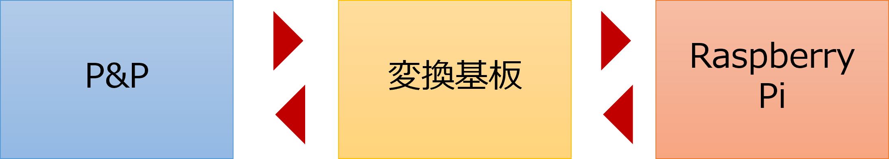
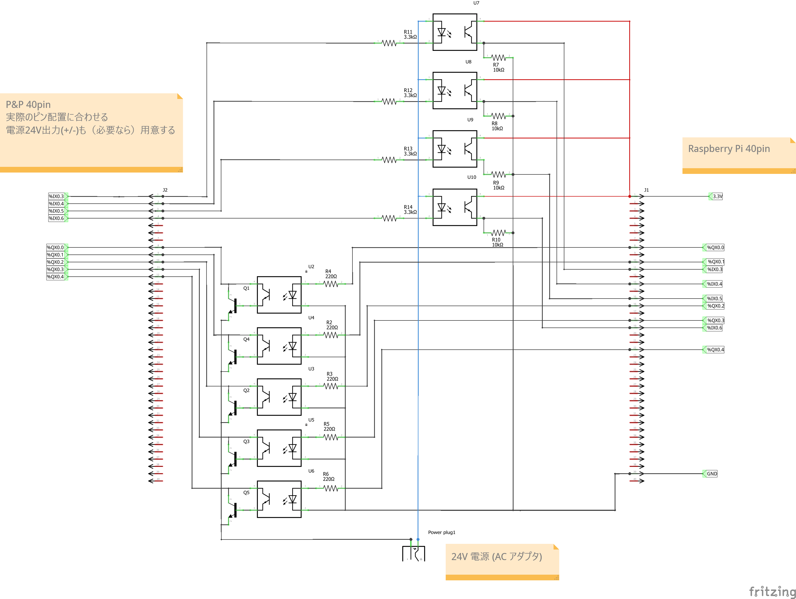

# P&P 基板の作成

フルカラー LED の調光回路を通して、Fritzing の使い方を学習した。  
最後に P&P 用の基板を作成する。

1. P&P は入力が４つ、出力が５つということから、抵抗やフォトカプラ、トランジスタを必要数用意する。
2. OpenPLC の I/O 表を参考に、入力ピン、出力ピンを決定する。
3. 40pin のリボンケーブル２本を用いて、P&P と Raspberry Pi を接続する。
4. 基板には 24V 電源を設ける。

# 回路

回路は以下のようになる。
P&P に電源が必要な場合にはその部分に改良を加える。

# 演習

## 基板の作成

- 図を参考に、fritzing を用いて回路図および PCB 基板を作成せよ。
  - **示した回路には P&P 側に24V電源が出ていない。必要に応じて出力する。**
  - **示した回路の P&P 側のピン配置は正しくない。各自で調べ正しいピン配置にする。**

## 使用しているパーツ

カッコ内は検索キーワード

- 抵抗 (resistor)
- NPN トランジスタ (transistor)
- PC817 フォトカプラ (coupler)
- 40 ピンヘッダ (pin header)
    - 穴サイズを Extra に変更する
- アダプタ用ジャック (power plug) 
  
基板が完成したらガーバーデータを作成、修正し、基板を作成せよ。

## OpenPLC プログラミング

- P&P のプログラムを OpenPLC 上に作成し、動作を確認せよ。
  (すべて実現するのが好ましいが、残された時間できる範囲でよい)