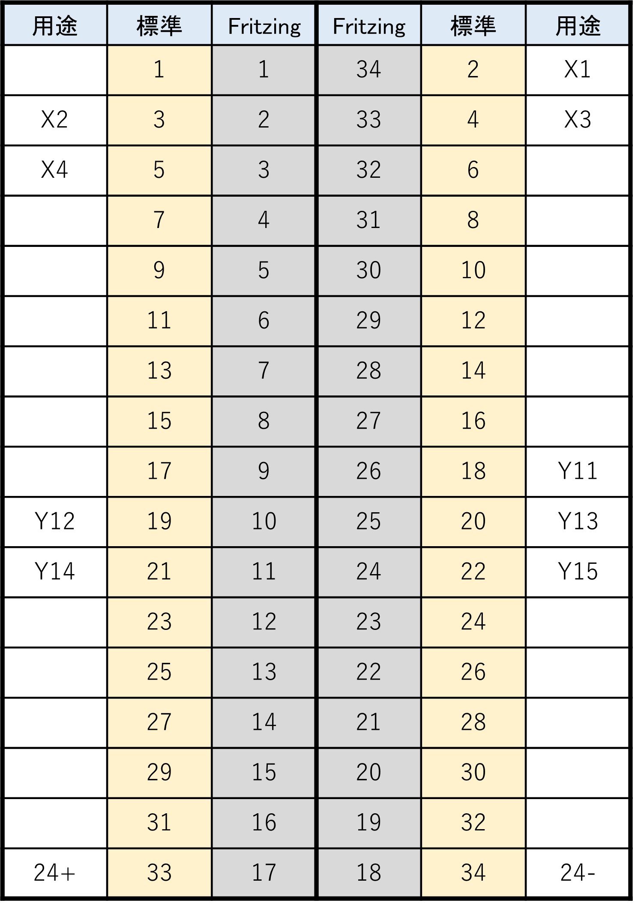

# P&P fritzing ファイル参考

<a href="./PandP.fzz">PandP.fzz</a>

以下の点に注目！

- 抵抗（素子）の下はくぐれる
- 使ってないピンヘッダと取りまわして、外側の列を内側にもってきている（内側のピンの機能はもう使えないが）
- ↑ GND はつなげないように！

## 補足：ピンヘッダの穴のおおきさ

Medium でも刺さることを確認しました。

## ガーバーデータ
穴の大きさなど、一連の必要な修正済みのガーバーデータはこちら：

- <a href="PandP_contour.gm1">PandP_contour.gm1</a>
- <a href="PandP_copperBottom.gbl">PandP_copperBottom.gbl</a>
- <a href="PandP_drill.txt">PandP_drill.txt</a>

## ピン配置表

P&P 側の 34 ピンのピン配置：

